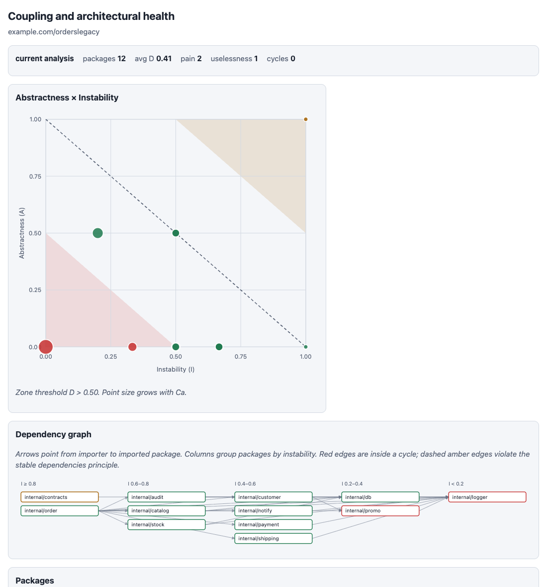

# gocouple

[](https://github.com/reinaldosaraiva/gocouple/actions/workflows/ci.yml)
[](https://pkg.go.dev/github.com/reinaldosaraiva/gocouple)
[](https://goreportcard.com/report/github.com/reinaldosaraiva/gocouple)
[](LICENSE)
[](https://github.com/reinaldosaraiva/gocouple/releases)

Métricas de acoplamento e saúde arquitetural ao longo do tempo para Go. [English](README.md) | Português

O `gocouple` mede como os pacotes de um módulo Go dependem uns dos outros (Ca, Ce, instabilidade, abstração, distância da main sequence, ciclos), diagnostica os padrões que machucam, acompanha tudo ao longo do histórico do git, gera um relatório HTML autocontido e derruba o seu CI quando a arquitetura piora.

## Por que medir acoplamento continuamente

As métricas de acoplamento são antigas e úteis, mas ninguém as calcula à mão, então ficam desatualizadas a cada feature. O `gocouple` torna a arquitetura observável: um número que aparece no diff de um pull request, uma tendência que dá para olhar e um gate que impede regressões. Também dá a pessoas e agentes de IA uma definição objetiva e compartilhada de "essa refatoração terminou".

## Instalação

```bash
go install github.com/reinaldosaraiva/gocouple/cmd/gocouple@latest
```

Ou baixe o binário para Linux, macOS ou Windows (amd64, arm64) na [página de releases](https://github.com/reinaldosaraiva/gocouple/releases) e veja [Verificando releases](#verificando-releases).

## Início rápido

```bash
gocouple analyze ./...                       # tabela com métricas, zonas e diagnósticos
gocouple analyze --format json --out analysis.json ./...
gocouple history --max 30 --out history.json # analisa os últimos 30 commits, com cache
gocouple report --history history.json --out report.html
gocouple check ./...                         # exit 0 ok, 1 violação, 2 erro
```

Formatos do `analyze`: `table`, `json`, `csv`, `markdown` (pronto para comentar em PR), `dot` e `mermaid` (grafo de dependências). Abra o [relatório de exemplo](examples/report.html) sem instalar nada; ele mostra um serviço pequeno piorando ao longo de três commits e depois sendo refatorado.

## Métricas e zonas

| Métrica | Significado |
|---------|-------------|
| Ca | pacotes que dependem deste |
| Ce | pacotes dos quais este depende |
| I | instabilidade, `Ce / (Ca + Ce)` |
| A | abstração, interfaces / tipos nomeados |
| D | distância da main sequence, `abs(A + I - 1)` |

No diagrama A × I, a main sequence é a reta de (I 0, A 1) até (I 1, A 0). Pacotes perto dela equilibram estabilidade e abstração. Um pacote estável e concreto usado por muitos outros (canto inferior esquerdo) está na **zona de dor**: mudá-lo machuca todo mundo. Um pacote abstrato do qual ninguém depende (canto superior direito) está na **zona de inutilidade**. Definições completas, limiares e limitações conhecidas estão em [docs/metrics.md](docs/metrics.md) (em inglês).

Diagnósticos: `pain-zone`, `uselessness-zone`, `god-package`, `dependency-cycle`, `concrete-hotspot`, `sdp-violation` (estável depende de instável) e `wasted-abstraction` (interface sem consumidores, ou cujos consumidores ainda dependem da implementação), este último baseado em `go/types`.

## Antes e depois

`testdata/orders-legacy` é um sistema de pedidos propositalmente problemático; `testdata/orders-refactored` é o mesmo domínio depois de colocar o logger atrás de uma interface injetada, depender de contratos e compor em `cmd/`. Saída real:

```text
$ gocouple analyze --dir testdata/orders-legacy ./...
PACKAGE              Ca  Ce  I     Na  Nc  A     D     ZONE
internal/contracts   0   1   1.00  2   2   1.00  1.00  uselessness
internal/logger      10  0   0.00  0   1   0.00  1.00  pain
internal/promo       2   1   0.33  0   0   0.00  0.67  pain
...
Summary: packages=12 avg_distance=0.41 pain=2 uselessness=1 main_sequence=9 isolated=0 cycles=0

Diagnostics (8)
[warning] pain-zone internal/logger: stable and concrete package used by 10 packages; introduce a contract ...
[warning] concrete-hotspot internal/logger: package without abstractions is imported directly by 10 packages
[warning] god-package internal/order: package imports 10 packages (threshold 8) and knows too much
[warning] wasted-abstraction internal/payment: interface Gateway exists, but consumers depend on its implementation ...
[warning] wasted-abstraction internal/notify: interface Notifier has no consumers outside its package
...

$ gocouple analyze --dir testdata/orders-refactored ./...
Summary: packages=7 avg_distance=0.39 pain=0 uselessness=0 main_sequence=7 isolated=0 cycles=0

Diagnostics (0)
```



O HTML completo da análise do legado está em [examples/orders-legacy.html](examples/orders-legacy.html).

## Usando com agentes de IA

- Entregue a análise como contexto antes de o agente planejar uma refatoração: `gocouple analyze --format markdown ./... > architecture.md`.
- Use o gate como critério de pronto: gere antes `gocouple analyze --format json --out baseline.json ./...` e exija `gocouple check --baseline baseline.json ./...` com exit 0 depois da mudança. Só regressões falham, então a dívida existente não bloqueia o trabalho.

## Uso no CI

```yaml
- uses: actions/checkout@v4
- uses: reinaldosaraiva/gocouple@v0
  with:
    args: ./...
```

O `check` imprime anotações do GitHub quando `GITHUB_ACTIONS=true`. Entradas: `args` (deve ser confiável, é separado por palavras), `baseline`, `version` (fixe uma tag como `v0.1.0` para builds reproduzíveis; o padrão é `latest`), `working-directory`. Limiares, códigos de saída e um workflow simples estão em [docs/ci.md](docs/ci.md) (em inglês).

## Configuração

Volatilidade opcional: `gocouple analyze --volatility-since 180d` adiciona a coluna `CHURN` e move um achado `pain-zone` de um pacote que não mudou na janela para a lista `Suppressed`, com o motivo; veja [docs/metrics.md](docs/metrics.md#volatility-opt-in). Exige o histórico git completo (`fetch-depth: 0` no CI).

`.gocouple.yaml` na raiz do módulo (ou `--config`); flags sobrescrevem o arquivo e o arquivo sobrescreve os padrões. Todas as chaves estão em [docs/metrics.md](docs/metrics.md#configuration).

## Verificando releases

Os arquivos de release estão listados em `checksums.txt`, assinado com cosign keyless, e cada arquivo tem um SBOM (Syft). A procedência do build é atestada com GitHub Artifact Attestations.

```bash
cosign verify-blob checksums.txt \
  --bundle checksums.txt.sigstore.json \
  --certificate-identity-regexp '^https://github\.com/reinaldosaraiva/gocouple/\.github/workflows/release\.yml@refs/tags/v.*$' \
  --certificate-oidc-issuer https://token.actions.githubusercontent.com
sha256sum --check --ignore-missing checksums.txt
gh attestation verify gocouple_<versao>_<os>_<arch>.tar.gz --repo reinaldosaraiva/gocouple
```

## Comparação

- [spm-go](https://github.com/fdaines/spm-go) conta structs e interfaces como abstrações; o `gocouple` conta apenas interfaces (excluindo interfaces só de constraint), o que é mais próximo da definição original.
- [Go Architect](https://go-architect.github.io/) oferece um grafo de dependências interativo e um gráfico A × I; o `gocouple` acrescenta histórico sobre o git, um gate de CI com baseline e diagnósticos como `wasted-abstraction`.
- [go-coupling](https://pkg.go.dev/github.com/richardwooding/go-coupling) reporta Ca, Ce e I com ciclos, mas sem abstração.
- Linters de regras de arquitetura como [go-arch-lint](https://github.com/fe3dback/go-arch-lint) e [arch-go](https://github.com/arch-go/arch-go) impõem regras de camadas; o `gocouple` mede forma e tendência e não impõe camadas.

## Limitações conhecidas

Granularidade de pacote (não de arquivo), sem detecção de reflection ou injeção via `any`, interfaces genéricas e vazias ignoradas pelo `wasted-abstraction`, apenas o módulo principal é classificado (sem unir `go.work`), e todo pacote sem dependências e sem interfaces cai na zona de dor pela própria definição da métrica, por isso o `pain-zone` exige um número mínimo de dependentes. Detalhes em [docs/metrics.md](docs/metrics.md#known-limitations).

## Roadmap

- Volatilidade no gráfico do relatório HTML (tamanho do ponto ou trilha de hotspot) e volatilidade por commit no `history`.
- Regras de camadas e allowlists, ou integração com linters de arquitetura existentes.
- Localização de código nos diagnósticos para anotações precisas.

## Licença

MIT, veja [LICENSE](LICENSE).
